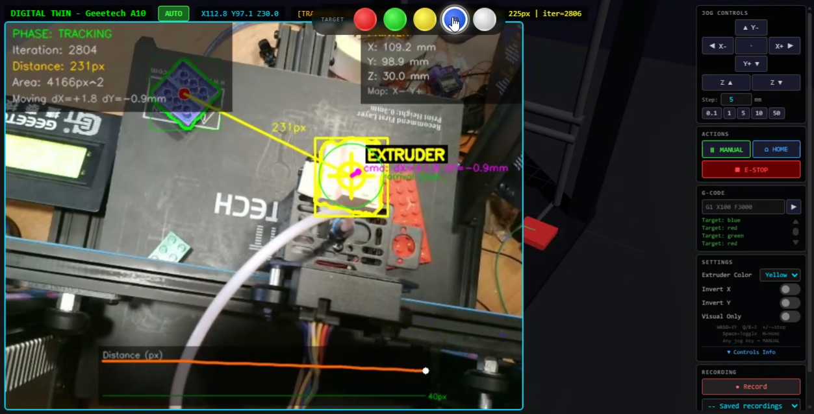

# 3D Printer Tracker — Vision-Guided Marlin Controller

A real-time vision-guided control system for Marlin-compatible FDM printers. A USB camera mounted on the extruder tracks colored objects on the build plate using OpenCV HSV detection, and the printer automatically follows the target — closing the loop between what the camera sees and where the nozzle moves.

<p align="center">
  
</p>

## Key Features

- **Color tracking** — select a target color (red, green, yellow, blue, white) and the extruder follows it autonomously
- **Ghost anchor** — when the extruder occludes the target, the system maintains a projected belief of the target's position using recent motion history (magenta dashed circle overlay)
- **Digital Twin UI** — browser interface at `http://127.0.0.1:8767/twin` with live MJPEG feed, jog controls, G-code console, settings, and recording/replay
- **Recording & replay** — capture manual or auto-tracked move sequences and replay them on demand
- **Multi-service architecture** — camera server (`:8766`), printer backend (`:8765`), and visual servo + UI (`:8767`) coordinated by a Windows Job Object launcher
- **Safety-first** — soft limits, cold-extrusion guard, E-STOP, and no movement without explicit command

## Hardware

| Component | Details |
|-----------|---------|
| Printer | Geeetech A10 (Marlin 1.1.8) on COM11 @ 250000 baud |
| Camera | NewEye 62 USB webcam mounted on extruder carriage |
| Controller | Windows PC running Python 3.10+ |

## Quick Start

```bat
cd Projects\3D_Printer\printer_controller
.\printer_tracker.bat
```

Then open **[http://127.0.0.1:8767/twin](http://127.0.0.1:8767/twin)** in a browser.

## Documentation

The full project documentation (setup, UI guide, API reference, architecture) lives in:

**→ [printer_controller/README.md](printer_controller/README.md)**
