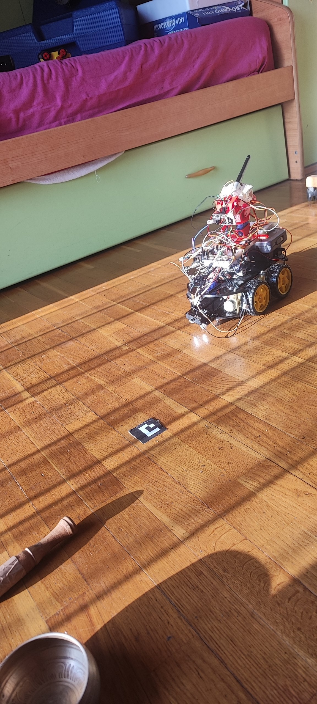
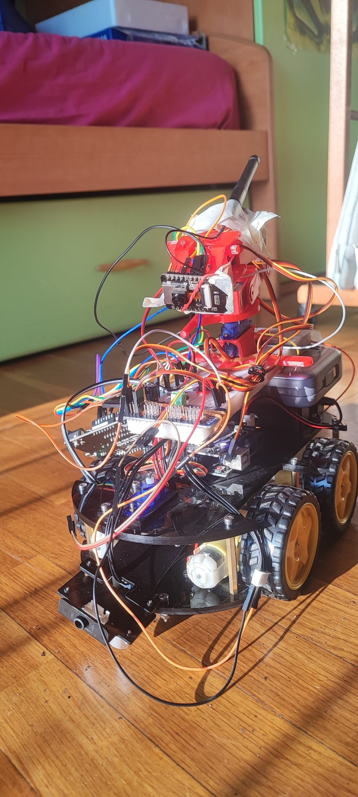

# ArduinoWorkshop

A long-running personal lab of embedded, robotics, computer-vision and human-interface experiments. The repository spans **Arduino / ESP32 firmware**, **Python desktop and serial GUIs**, **OpenCV vision pipelines**, **VR / Godot integrations**, **MQTT-connected robots**, and **research-oriented prototypes** (drones, robot arms, quadrupeds, vision-guided 3D printing).

> **Featured: [ESP32-CAM Robot Arm Car — VR Teleoperation](Projects/ESP32-CAM-PlatformIO/README.md)**
> Drive a robot car with a camera arm from a Quest 2 headset. Head tracking controls the arm, joystick drives the car.

<p align="center">
  
  
</p>

> **Featured: [3D Printer Tracker — Vision-Guided Marlin Controller](Projects/3D_Printer/printer_controller/README.md)**
> Browser digital-twin UI at `http://127.0.0.1:8767/twin` with color tracking, ghost anchor under occlusion, and recording / replay of moves.

> **Featured: [Circuit Designer](Projects/CircuitDesigner/README.md)**
> Visual circuit designer with drag-and-drop components, pin-level wiring, and a built-in Arduino code simulator.

---

## Repository Layout

```
ArduinoWorkshop/
├─ Projects/                          # Standalone projects (Arduino / Python / mixed)
├─ K5--37 sensor kit for arduino/     # 38-module sensor-kit example sketches
├─ Arduino Learning Materials/        # PDFs, datasheets, course handouts
├─ scripts/                           # CI / build helpers
├─ test/                              # Cross-project tests and simulations
└─ memories/, logs/                   # Agent / session notes
```

---

## Project Index

### 🤖 VR / Teleoperation / Featured Systems

- [ESP32-CAM-PlatformIO](Projects/ESP32-CAM-PlatformIO/README.md) — VR robot-arm car teleoperated from a Quest 2 headset.
- [3D_Printer / printer_controller](Projects/3D_Printer/README.md) — Vision-guided Marlin controller with browser digital twin.
- [CircuitDesigner](Projects/CircuitDesigner/README.md) — Browser visual circuit designer + Arduino simulator.
- [RobotBiped](Projects/RobotBiped/README.md) — Bipedal walking robot platform.

### 🦾 Robot Arms & Servo Controllers

- [PCA9685-ServoController](Projects/PCA9685-ServoController/README.md) — 16-channel PCA9685 + Tk GUI bench.
- [PotentiometerArmController](Projects/PotentiometerArmController/README.md) — 16-DOF arm receiver (v1 protocol).
- [PotentiometerArmControllerV2](Projects/PotentiometerArmControllerV2/README.md) — Extended dual-arm protocol.
- [RobotArmController](Projects/RobotArmController/README.md) — Android USB-OTG Tk/Kivy controller.
- [RobotArmControllerV2](Projects/RobotArmControllerV2/README.md) — Updated 16-DOF receiver with jump-fix.
- [RobotArmRevised](Projects/RobotArmRevised/README.md) — Glove-driven biped/arm with gait editor.
- [SpotController](Projects/SpotController/README.md) — Spot-style quadruped controller.
- [ServoTester](Projects/ServoTester/README.md) — 16-channel servo bench tool.
- [ServoFeedback](Projects/ServoFeedback/README.md) — Analog servo position feedback reader.
- [ServoPotentiometer](Projects/ServoPotentiometer/README.md) — Knob → servo (with / without driver).
- [EncoderServoTester](Projects/EncoderServoTester/README.md) — Rotary-encoder driven multi-servo tuner.
- [SimpleMPUServo](Projects/SimpleMPUServo/README.md) — MPU6050 → single servo.
- [MPU6050_Servo01](Projects/MPU6050_Servo01/README.md) — MPU6050 → PCA9685 servo bridge.
- [RoboticsDesignTask](Projects/RoboticsDesignTask/README.md) — Course assignment: pose mapper.
- [arduino-servo-simulation](Projects/arduino-servo-simulation/README.md) — Tk GUI servo controller.

### 📡 ESP32 / IoT / MQTT

- [ESP32-CAM](Projects/ESP32-CAM/README.md) — Camera web server + MQTT variant.
- [ESP32Micropython](Projects/ESP32Micropython/README.md) — MicroPython ESP32-CAM samples.
- [SerialToSerialBT](Projects/SerialToSerialBT/README.md) — BT-serial → IR transmitter bridge.
- [MQTT_RC_Car](Projects/MQTT_RC_Car/README.md) — MQTT-driven RC car.
- [MQTT_RC_Car_Arm](Projects/MQTT_RC_Car_Arm/README.md) — RC car + 4-DOF arm over MQTT.
- [MQTT_RC_Car_Arm_IR](Projects/MQTT_RC_Car_Arm_IR/README.md) — As above + IR transmitter.
- [TkEV3](Projects/TkEV3/README.md) — LEGO EV3 + MQTT + Tk drag-and-drop UI.

### 🛩️ Drones & Radio

- [F8620_Drone](Projects/F8620_Drone/README.md) — Custom flight controller for the F8620 quadcopter.
- [F8620_USBTransmitter](Projects/F8620_USBTransmitter/README.md) — RF24-based protocol finder/replay tools.
- [DroneSerial](Projects/DroneSerial/README.md) — Serial → drone receiver PWM bridge.
- [nRF24_PingPong](Projects/nRF24_PingPong/README.md) — nRF24L01 latency tester (Uno ↔ ESP).
- [nRF24_ServoStream](Projects/nRF24_ServoStream/README.md) — nRF24-streamed servo control.

### 🚗 RC Cars

- [RC Car](Projects/RC%20Car/README.md) — IR-remote RC car (servo + motor PWM).
- [Skid_RC_Car](Projects/Skid_RC_Car/README.md) — Skid-steer RC car with HG7881 driver.

### 💡 LED Strips & Color

- [LedRGB](Projects/LedRGB/README.md) — Common-cathode RGB LED palette cycler.
- [LedStripWS2812B](Projects/LedStripWS2812B/README.md) — WS2812B serial color receiver.
- [LedTie](Projects/LedTie/README.md) — Wearable WS2812B with two-button control.
- [LedStripGui](Projects/LedStripGui/README.md) — Tk RGB sliders → LedTie.
- [SmoothLedStrip](Projects/SmoothLedStrip/README.md) — Smooth WS2812B transitions.
- [SmoothLedStripV2](Projects/SmoothLedStripV2/README.md) — V2 smoothing.
- [SmoothLedStripV2Buttons](Projects/SmoothLedStripV2Buttons/README.md) — V2 + standalone buttons.
- [AmbientLeds](Projects/AmbientLeds/README.md) — Ambient backlight strip with two buttons.
- [AnimeColor](Projects/AnimeColor/README.md) — Screen-capture color → serial → strip.
- [OpenCVwebCamera](Projects/OpenCVwebCamera/README.md) — Webcam color/shape detection + IR blaster.
- [OpenCV webCamera](Projects/OpenCV%20webCamera/README.md) — Empty placeholder (superseded).

### 📺 IR Remote Tools

- [IrReceiver](Projects/IrReceiver/README.md) — Decode IR remote presses.
- [IrCodeGenerator](Projects/IrCodeGenerator/README.md) — Generates ready-to-paste switch cases for IR codes.
- [IrBlaster](Projects/IrBlaster/README.md) — Sends NEC hex codes from serial input.

### 🔊 Audio / Sound

- [MP3Only](Projects/MP3Only/README.md) — DFPlayer Mini auto-play.
- [Mp3Player](Projects/Mp3Player/README.md) — DFPlayer with playback controls.
- [AudioSensor](Projects/AudioSensor/README.md) — Analog audio amplitude streamer.

### ⌨️ Sensors & Inputs

- [i2c_scanner](Projects/i2c_scanner/README.md) — I2C bus scanner.
- [MPU6050_Mouse](Projects/MPU6050_Mouse/README.md) — MPU6050 → mouse-input streamer.
- [RotaryEncoder](Projects/RotaryEncoder/README.md) — KY-040 quadrature counter.
- [SimplePotentiometer](Projects/SimplePotentiometer/README.md) — Pot reader.
- [UduinoMPU6050](Projects/UduinoMPU6050/README.md) — I2Cdev + MPU6050 library copy for Unity bridge.

### 🖥️ Displays

- [4digit](Projects/4digit/README.md) — 4-digit 7-segment clock counter.
- [dht](Projects/dht/README.md) — DHT11 placeholder slot.

### 🔧 Utilities & Misc

- [SerialPrinter](Projects/SerialPrinter/README.md) — Minimal serial-triggered LED toggle.
- [SpeakingMotor](Projects/SpeakingMotor/README.md) — Empty scaffold.

---

## Sensor Kit (K5--37)

The folder `K5--37 sensor kit for arduino/` contains 38 self-contained example sketches — one per kit module — covering DS18B20 temperature, DHT11, photoresistors, joystick, IR receiver, Hall effect, sound, touch, relay, buzzers, LEDs, and many more.

---

## Conventions

- `snake_case` for C functions and variables, `PascalCase` for classes and Arduino sketch names, `UPPER_SNAKE_CASE` for constants and pin definitions.
- Pin numbers and board capabilities live in the project README or a config file — never hard-coded in non-obvious places.
- Conventional Commits format for messages: `<type>(<scope>): <description>`.
- Tests, when applicable, live under `test/` or each project's local `tests/` folder.

See [.github/copilot-instructions.md](.github/copilot-instructions.md) for the full team rules used by AI agents in this repo.

---

## Authors

- **Maurizio Vetere** — *TizioMaurizio* (original sensor-kit and learning-materials work)
- **Alessandro** — VR / robotics / vision-guided systems

## License

MIT — see [LICENSE.md](LICENSE.md).
